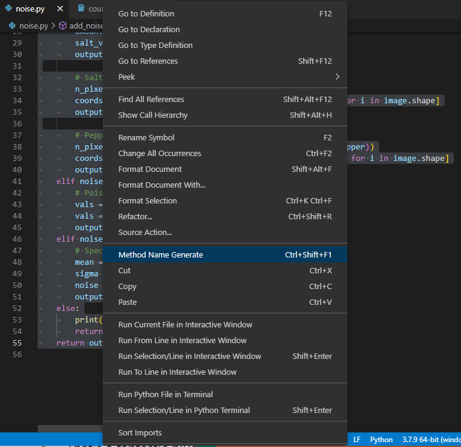
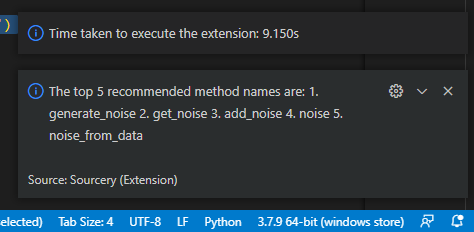

# Method Naming For Python

## Features

This plug-in uses a pre-trained CodeBERTa model to generate recommended method name for your code. After selecting the code that you want to name, right click on the selected text and choose "Method Name Generate" or use shortcut "Ctrl + Shift + F1" on Windows, a message containing the recommended method names will show at the right bottom corner. 

> Tip: The time taken to run the extension depends on the length of the selected text. It might take over 10 seconds for some cases.

## Requirements

The CodeBERTa model requires transformers and pytorch to run. You could install trnasformers with the following command:

    pip install transformers

You could install pytorch with the following command:

    pip3 install torch torchvision torchaudio

Dill is also required to load the model. You could install dill with this command:

    pip install dill

<!-- ## Extension Settings

Include if your extension adds any VS Code settings through the `contributes.configuration` extension point.

For example:

This extension contributes the following settings:

* `myExtension.enable`: enable/disable this extension
* `myExtension.thing`: set to `blah` to do something -->

## Known Issues

- The maximum length of the selected text is set to be 1000 characters. Any input which is longer than that will be capped at 1000 characters.
- The first time running this extension will unzip the model, which might take more time.

## Release Notes

### 1.0.0

- Initial release of Method Naming for Python

## 1.0.1

- Now the installation package includes the pre-trained model

## 1.0.2

- Change the model loading function. Now the model size is reduced.